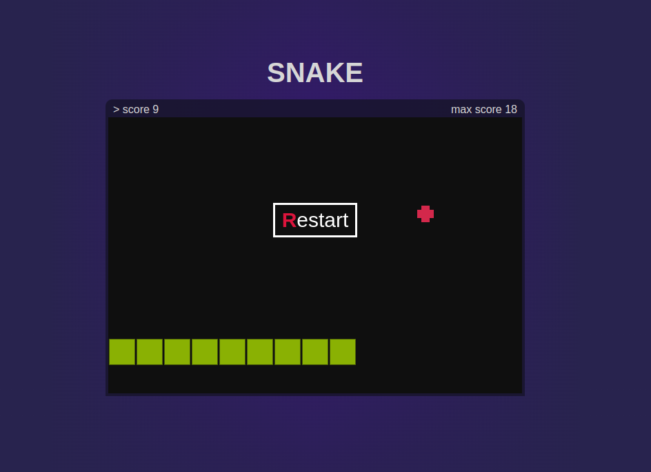

# 🐍 Snake Game

Juego Snake, hecho con JavaScript, HTML5 Canvas y CSS3.

---

## Características

- Movimiento con teclas de flecha (y opcionalmente WASD).
- Score actual y High Score persistente usando `localStorage`.
- Música de fondo que se reproduce automáticamente.
- Opción de reinicio rápido tras perder.
- Aceleración progresiva a medida que avanza el juego.
- Diseño minimalista.

---

## Tecnologías

- HTML5
- CSS3
- JavaScript (ES6)
- Canvas API
- LocalStorage API

---

## Capturas

---

## Cómo jugar

1. Iniciar el juego presionando Enter o clickeando "Enter".
2. Mover la serpiente usando las flechas de dirección.
3. Comer la comida roja para crecer y aumentar tu score.
4. Evitar chocar contra los bordes o contra ti mismo.
5. Intenta superar tu High Score

---

## Futuras Mejoras

- Agregar diferentes modos de juego.

---

## Autor

- **alexio-codev**
